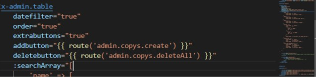
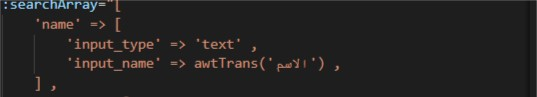

<p align="center"></p>

# Awamer Alshabak
Awamer Alshabak is a project for women developed using Laravel, and provides a platform for caring for women and their beauty, such as hair, nail and skin care.

## Table of Contents

- [Features](#features)
- [Installation](#installation)
- [Usage](#usage)
- [Dashboard Information](#dashboard-information)
- [Usage for create new section in dashboard](#usage-for-create-new-section-in-dashboard)
- [tips](#tips)
- [Dashboard components](#dashboard-components)
- [Notes for working with flutter team :](#notes-for-working-with-flutter-team)
- [postman publish](#postman-publish)
- [Design Links](#design-links)
- [Project links](#project-links)

## Features
- **Beauty Services:** Hair Care: Provide a platform for users to find hair care tips, products, and professionals.
Nail Care: Offer resources for nail care, including tutorials, recommended products, and local nail salons.
Skin Care: Deliver information and recommendations for effective skincare routines, products, and specialists.
- **Request services:** You can request a service from a specific center related to hair care, nail care, or skin care, whether inside the center, or request an expert to come to your home, or gift this service to another person.
- **Request offers:** You can request an offer from a specific center related to hair care, nail care, or skin care, whether inside the center, or request an expert to come to your home, or gift this service to the last person, and all of this depends on the offer.
- **Access to the dashboard:** The application provides an easy-to-use control panel for center owners to access and manage their information.
- **API Documentation:** The API comes with comprehensive documentation, making it easy for developers to understand and integrate with the various endpoints.
- ...

## Installation

1. Clone the repository:

    ```bash
    git clone https://gitlab.com/amirgaber2491/amir-base
    ```

2. Navigate to the project directory:

    ```bash
    cd amir-base
    ```

3. Install dependencies:

    ```bash
    composer i
    ```

4. Copy `.env.example` to `.env` and configure your environment variables:

    ```bash
    cp .env.example .env
    ```

5. Generate the application key:

    ```bash
    php artisan key:generate
    ```

6. Run the database migrations:

    ```bash
    php artisan migrate --seed
    ```

7. Serve the application:

    ```bash
    php artisan serve
    ```

Visit [http://127.0.0.1:8000](http://127.0.0.1:8000) in your browser to access the application.

## Usage

- Access the application in your browser.
- Register as a center (owner).
- Manage orders, offers, services, employees, and more.

## Dashboard Information

### You can log in to the dashboard using the following credentials:

- Link: [http://127.0.0.1:8000/admin/login](http://127.0.0.1:8000/admin/login)
- Email: aait@info.com
- Password: 123456

## Usage for create new section in dashboard

```bash
php artisan make:fullsection SectionName arabicSingleName arabicPluralName 
```

## tips 
- SectionName It must be singular, not plural, and begins with the capital letter 
- arabicSingleName The name of the section in Arabic singular
- arabicPluralName The name of the section in Arabic plural
- this command create for you meny files (Controller in Admin Folder , Model in Models folder , DataBase Migrate , Blade Folder in admin folder And Blade File , basic [index - store - update - delete] routes in web.php file for dashboard use )
- you can use ( --seed ) optional with command to create new Seeder for this section 
- you can use ( --request ) optional with command to create new form request file and folder in Request/Admin  for this section 
- you can use ( --resource ) optional with command to create new resource for this section in Resources/Api Folder

## Example
- for create new section for banks in dashboard run command  
```bash 
php artisan make:fullsection Bank بنوك بنك --seed --request --resource 
```
--- command create new files to use 

- new Controller (BankController.php) with  main functions (index - store - update - delete , deleteAll ) 

- new model (Bank.php) with its database migration

- new folder (banks) in resources/Admin folder and new blade files (index , create , update , show , table ) in this folder contains base structer of file you can edit edit it as you need 

- new seeder file (BanksTableSeeder) if you use (--seed) with command 

- new form Request folder (Banks) and request Files (Store , Update ) in Requests/Admin

- new Resource for Api use in Resources/APi if use (--resource)

-  new [show - store - update -delete , delete-all ] routes in web.php to use in dashboard 


## Dashboard components 

read more about laravel 8 components [here](https://laravel.com/docs/8.x/blade#components)

- <x-admin.table> table Contains from some of variables like 

<p align="center" width="100%" height="20px"></p>

- datefilter for show date filter inputs 
- order to show order by filter select input
- extrabuttons for show div of extrabutton to append new inputs to top table extra buttons will append to this slot (<x-slot name="extrabuttonsdiv"> </x-slot>)
- addbutton to show add button to open create page
- delete button to show delete all button 
- searchArray to append search filters inputs as we need , we can add input , select to table top filters . 
- filter input append like : (name is name of input should be same in database , input_type should be text or select , input_name is title of input lable) 

<p align="center" width="50%" height="10px"></p>

- filter select has two type : 

-- first type to filter with passed collection from controller : (rows is collection passed form database to show on select options to select one of them , row_name is the title will show in select options )

<p align="center" width="50%" height="10px"></p>

-- other type to filter with passed array : (rows is  passed array to show on select options to select one of them , row_name is the title will show in select options )


<p align="center" width="50%" height="10px"></p>

- <x-admin.alert> containt dashboard alerts 
- <x-admin.notify-all> containt user notifications models

## Dashboard scripts

- The following file contains a set of functions that facilitate working with graphs (admin/charts_functions.js)

## home page cards 

- all home page cards included in (app/traits/menu) file 

## home page weather widget 

-  You can control the country, colors, size, number of days and type of icons from the following link and copy your code and replace it on the home page [here](https://weatherwidget.io/) 

## notes after publish 
- run this commands in server to improve app speed performance
```bash
php artisan optimize
```
```bash
php artisan config:cache
```
```bash
php artisan route:cache
```

## Notes for working with flutter team :
1. in middleware : "Content-Type" => "application/json",
2. in upload trait : [$allowedMimeTypes add application/octet-stream ] [upload file $path = 'images/'. $directory ;
$file->storeAs($path, $filename);]

## postman publish
[https://documenter.getpostman.com/view/34598379/2sA3JNbftJ]()

## Design Links
- ### Center XD
[https://xd.adobe.com/view/351615cb-4035-4bed-881b-c0729df64ceb-6045/?fbclid=IwZXh0bgNhZW0CMTAAAR3GoOS-PWlutS3AaLCEHvz3K1aj3BFUik6iTj-cIE_3K7LnzLozfLbQj14_aem_AfWhmOo9uH9-lXVYJ4LXkNDlSaWGyUN1OsVqYSfMVB_yA4Rek1cH5lXjeZgn2UcL5fSpOErrj7yRtVdfWrg1-Va3]()
- ### Client XD
[https://xd.adobe.com/view/a84fcc6a-9a1e-4005-b6cd-a306be1f90c6-fd1c/specs/?fbclid=IwZXh0bgNhZW0CMTAAAR3MIrhGhgCv_cXnDCpIj60o5a5q-2uWSVI-b2aCuFLGGcgLdJmytbCKoXA_aem_AfWrmOqvh-r6u8NqeNO07L6KbWMP0GyxmF4wepDuN0-dyBB9nzmAAgx3eiyYuRlbvdkYzYFwzTKlea2q2ECkIJXc]()
 
<!-- http://127.0.0.1:8000/api/ -->

## Project links
 - site url : [http://127.0.0.1:8000](http://127.0.0.1:8000)
 - admin url : [http://127.0.0.1:8000/admin/login](http://127.0.0.1:8000/admin/login)
    - email : aait@info.com
    - password : 123456
    
